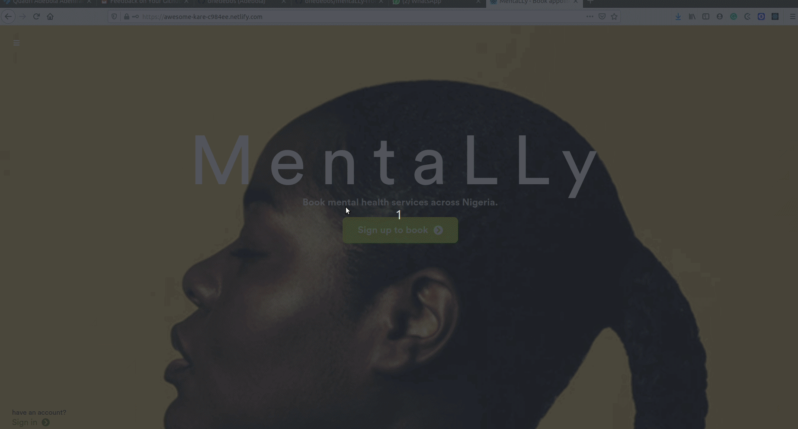

# Project Name

> This is a tablet(intended to be viewed on tablets) web app that allows people schedule
> appointments with mental health service providers in Nigeria.



The app includes a Rails API that renders JSON to be consumed
by React Views.

## Built With

- Rails
- React
- Bootstrap
- Node
- Axios
- Redux
- FontAwesomeIcons
- Circular std font

## Live Demo

[Live Demo Link](https://awesome-kare-c984ee.netlify.com/)

## Getting Started

**To get started, follow the instructions below**

To get a local copy up and running follow these simple example steps.

- git clone the frontend repo

```
git clone https://github.com/onedebos/mentaLLy-frontend.git
```

- git clone the backend repo if you want to run the server on your local machine. Otherwise, skip the next 3 steps.

```
git clone https://github.com/onedebos/mentaLY-rails-API.git
```

- cd into the backend repo and install the gems

```
bundle install
```

- run the rails server on port 3001

```
rails s -p 3001
```

- If you decide to run the server locally, cd into the frontend repo. Navigate to src/components/helper/apiUrl.js and change the API_URL string to

```
http://localhost:3001
```

- run

```
npm install
```

to install all packages. then

```
npm start
```

- to start the app in the browser.

- To access the Admin account/panel, use the following information.

- email: admin@mentallybook.com
- password: password

- Admin can create a new provider.

### Prerequisites

- npm
- node

## Authors

👤 **Adebola**

- Github: [@githubhandle](https://github.com/onedebos)
- Twitter: [@twitterhandle](https://twitter.com/debosthefirst)
- Linkedin: [linkedin](https://www.linkedin.com/in/adebola-niran/)

## 🤝 Contributing

Contributions, issues and feature requests are welcome!

Feel free to check the [issues page](issues/).

## Show your support

Give a ⭐️ if you like this project!

## Acknowledgments

- Thanks to [Murat Kohmaz](https://www.behance.net/gallery/26425031/Vespa-Responsive-Redesign) for his design.
- Thanks to [Jessica Felicio](https://unsplash.com/photos/QS9ZX5UnS14) for images
- logos used from [hatchful](https://www.bookmarks.design/media/image/hatchful.jpg)

## 📝 License

This project is [MIT](lic.url) licensed.
